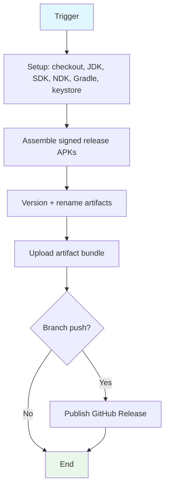

## Workflow Overview

**Purpose**: Build, sign, and publish versioned release APKs (all ABIs + universal) on every master push.
**Trigger Events**: push to master, push of `v*` tags, pull requests to master, manual dispatch.
**Target Environments**: GitHub-hosted Linux runners; artifacts consumed by Android devices (arm64 primary).

## Execution Flow Diagram



## Jobs & Dependencies

| Job Name | Purpose | Dependencies | Execution Context |
|----------|---------|--------------|-------------------|
| build | Full pipeline (setup, assemble, version, upload, release) | None (single job) | ubuntu-24.04 runner (pinned; latest migrates to 26) |
| fast | Manual arm64-only debug APK, release-signed + published as v<code> so the in-app updater picks it up | None (single job) | ubuntu-24.04 runner |

## Requirements Matrix

### Functional Requirements
| ID | Requirement | Priority | Acceptance Criteria |
|----|-------------|----------|-------------------|
| REQ-001 | Produce signed release APKs for all 4 ABIs plus universal | High | Artifact bundle contains 5 APKs, all installable |
| REQ-002 | Monotonic versioning | High | versionCode = run number + 100; filenames carry versionName |
| REQ-003 | Publish a GitHub Release per master push | High | Tag `v<code>` exists with APKs + changelog body |
| REQ-004 | PR/tag/manual runs build but never publish | High | No release created unless branch push event |
| REQ-005 | Human-readable changelog from commit subjects | Medium | ASCII-only subject list since previous release tag |
| REQ-006 | Cold-start safe setup (no assumed runner state) | Medium | Missing SDK/NDK components install on demand |
| REQ-007 | Superseded runs cancel instead of stacking | Medium | New push on same ref cancels the older in-flight run |

### Security Requirements
| ID | Requirement | Implementation Constraint |
|----|-------------|---------------------------|
| SEC-001 | Least-privilege token | Job-scoped write access only where release publishing needs it |
| SEC-002 | Pinned third-party actions | Full commit SHA + readable version comment on every `uses:` |
| SEC-003 | No secret leakage | Secrets flow via environment only; keystore material lives in ephemeral temp dir |
| SEC-004 | No untrusted-code execution | No fork-controlled inputs interpolated into shell steps |
| SEC-005 | Persistent signing identity | Same release key every build so updates install over stored data |

### Performance Requirements
| ID | Metric | Target | Measurement Method |
|----|-------|--------|-------------------|
| PERF-001 | Wall-clock per master push | < 4 min typical | Run duration of completed builds |
| PERF-002 | Redundant builds on rapid pushes | 0 | Cancelled superseded runs |
| PERF-003 | Native rebuild on app-only changes | Skipped | Up-to-date native tasks via source-keyed cache |

## Input/Output Contracts

### Inputs

```yaml
# Secrets (environment-scoped, never logged)
RELEASE_KEYSTORE_B64: secret  # Purpose: persistent signing key
RELEASE_KEYSTORE_PASSWORD: secret
RELEASE_KEY_ALIAS: secret
RELEASE_KEY_PASSWORD: secret
SMS_API_KEY: secret           # Purpose: baked into build config
SMS_GATEWAY_URL: secret

# Repository Triggers
branches: [master]
tags: [v*]
```

### Outputs

```yaml
# Job Outputs
version_code: string  # Description: run number + 100, drives tag name
build_artifact: file  # Description: versioned release APK set (app-release)
github_release: tag   # Description: v<version_code> with APKs + changelog
```

### Secrets & Variables

| Type | Name | Purpose | Scope |
|------|------|---------|-------|
| Secret | RELEASE_KEYSTORE_* (4) | APK signing identity | Workflow |
| Secret | SMS_API_KEY / SMS_GATEWAY_URL | Build-time backend config | Workflow |

## Execution Constraints

### Runtime Constraints

- **Timeout**: None declared (runner default applies)
- **Concurrency**: One run per ref; newer run cancels older
- **Resource Limits**: Build heap sized for hosted runner (4 GB Gradle daemon)

### Environmental Constraints

- **Runner Requirements**: Linux, Java 17, Android SDK platform + build-tools 36, NDK r27
- **Network Access**: SDK/NDK install, dependency resolution, cache + release APIs
- **Permissions**: Contents write (release publishing only)

## Error Handling Strategy

| Error Type | Response | Recovery Action |
|------------|----------|-----------------|
| Compilation failure | Run fails, no release | Read failing step log, fix code, push again |
| Missing toolchain piece | Install on demand | NDK/SDK steps self-install when absent |
| Signing secrets absent (e.g. fork PR) | Fall back to debug signing | No action; artifacts unsigned-verifiable only |
| Superseded by newer push | Run cancelled | None; the newer run publishes |

## Quality Gates

### Gate Definitions

| Gate | Criteria | Bypass Conditions |
|------|----------|-------------------|
| Build green | All assemble + package steps succeed | Never |
| Publish gate | Branch push event only | PRs, tag pushes, manual runs skip release |

## Monitoring & Observability

### Key Metrics

- **Success Rate**: 100% target on master pushes
- **Execution Time**: ~5 min cold, ~3 min warm (native cache hit)
- **Resource Usage**: CI minutes via Actions usage; cache footprint under repo limits

### Alerting

| Condition | Severity | Notification Target |
|-----------|----------|-------------------|
| Run failure on master push | High | Watch via `monitor-build.go` (repo root) |
| Repeated cache misses | Low | Review cache keys vs source churn |

## Integration Points

### External Systems

| System | Integration Type | Data Exchange | SLA Requirements |
|--------|------------------|---------------|------------------|
| GitHub Releases | Publish | APKs + changelog markdown | Per-push availability |
| Actions cache | Build acceleration | NDK tree, native intermediates | Best-effort (miss = slower build) |
| In-app updater | Consume | Parses release tags for version checks | Monotonic versions required |

### Dependent Workflows

| Workflow | Relationship | Trigger Mechanism |
|----------|--------------|-------------------|
| None | — | Single-workflow pipeline |

## Compliance & Governance

### Audit Requirements

- **Execution Logs**: Retained per Actions policy; failures diagnosed from step logs
- **Approval Gates**: None (push-to-release is automatic)
- **Change Control**: Workflow edits ship like code (reviewed push to master)

### Security Controls

- **Access Control**: Job token scoped to contents write
- **Secret Management**: Repository secrets; rotation out-of-band
- **Vulnerability Scanning**: Action SHAs audited on change

## Edge Cases & Exceptions

### Scenario Matrix

| Scenario | Expected Behavior | Validation Method |
|----------|-------------------|-------------------|
| Push with no code change (e.g. docs) | Full build + release anyway | Release tag appears |
| Two pushes within seconds | Older run cancels, newer publishes | Cancelled conclusion on older run |
| Native sources untouched | C compile skipped via cache | Native tasks up-to-date in log |
| First run after NDK bump | Cache miss, full toolchain install | Slower run, new cache entry saved |
| Tag push `v*` | Builds, no release published | No duplicate release created |

## Validation Criteria

### Workflow Validation

- **VLD-001**: Every `uses:` carries a full SHA plus version comment
- **VLD-002**: Release publishes if and only if branch push event
- **VLD-003**: Universal APK installs over prior release without data loss (same key, higher code)

### Performance Benchmarks

- **PERF-001**: Kotlin-only push completes in under 4 minutes warm
- **PERF-002**: No two concurrent runs on the same ref

## Change Management

### Update Process

1. **Specification Update**: Modify this document first
2. **Review & Approval**: Push review like any code change
3. **Implementation**: Apply changes to workflow
4. **Testing**: Watch the triggered run via `monitor-build.go`
5. **Deployment**: Effective on merge to master

### Version History

| Version | Date | Changes | Author |
|---------|------|---------|--------|
| 1.0 | 2026-09-22 | Initial specification | agent |

## Related Specifications

- `monitor-build.go` (repo root) — run-wait procedure referenced above
- AGENTS.md Build section — mandatory CI rules
